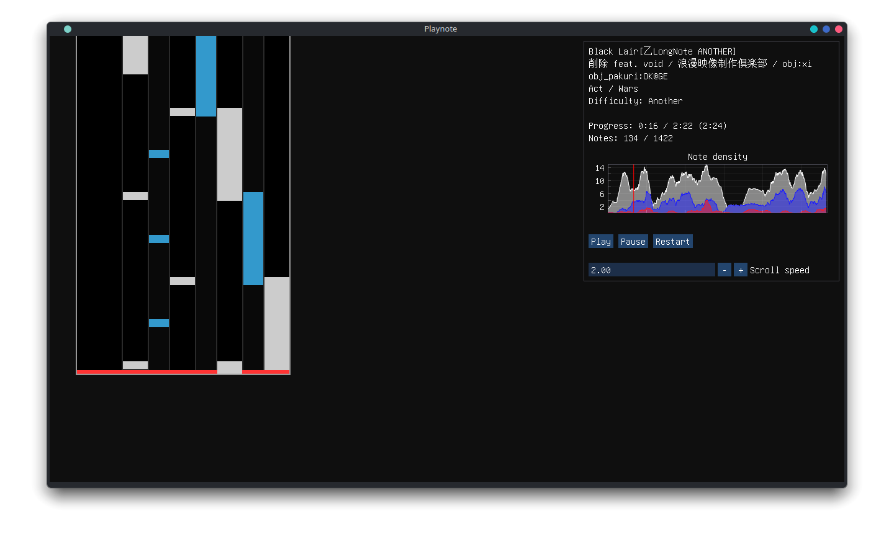

# Playnote

The next generation [BMS](https://en.wikipedia.org/wiki/Be-Music_Source) player for Windows and Linux. **Work in progress**.

## Development

Check out the [Dev Blog](https://tear.moe/tag/playnote/) for progress reports and other various write-ups.

See the [Wiki](https://github.com/Tearnote/Playnote/wiki) for usage, building and documentation, or consult the [Roadmap](https://github.com/users/Tearnote/projects/4/views/1) for current development status.

## Builds

Find the latest Windows test build in [CI artifacts](https://github.com/Tearnote/Playnote/actions/workflows/windows-build.yml).

## License

The project as a whole is licensed under the [Mozilla Public License 2.0](LICENSE-MPL-2.0.txt). Some individual files are also licensed under the [Boost Software License](LICENSE-BSL-1.0.txt). For details, see the copyright disclaimer at the top of the relevant file, or the containing folder. Unless otherwise specified, only the MPL 2.0 applies.
