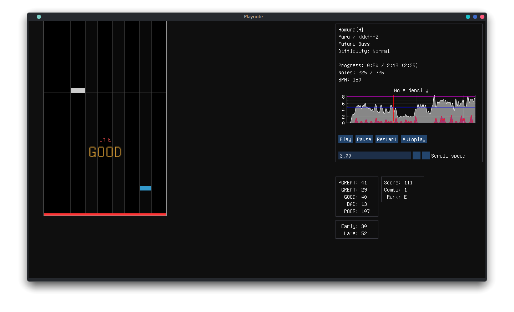

# Playnote

The next generation [BMS](https://en.wikipedia.org/wiki/Be-Music_Source) player for Windows and Linux. **Work in progress**; currently capable of manual play and autoplay of one chart at a time, with placeholder UI.

See the [Wiki](https://github.com/Tearnote/Playnote/wiki) for usage, building and documentation, or consult the [Roadmap](https://github.com/users/Tearnote/projects/4/views/1) for current development status.

Find the latest Windows test build in [CI artifacts](https://github.com/Tearnote/Playnote/actions/workflows/windows-build.yml).

